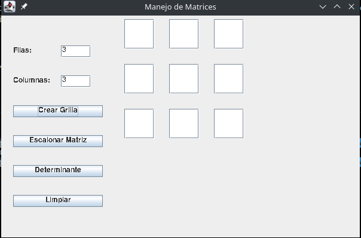

# Manejo-Matrices

Programa para analizar la complejidad (Notacion big O),de los algoritmos de reduccion y determinanate por gauss aplicados en matrices

## Autor

Sergio David Paez Suarez
## Interfaz

